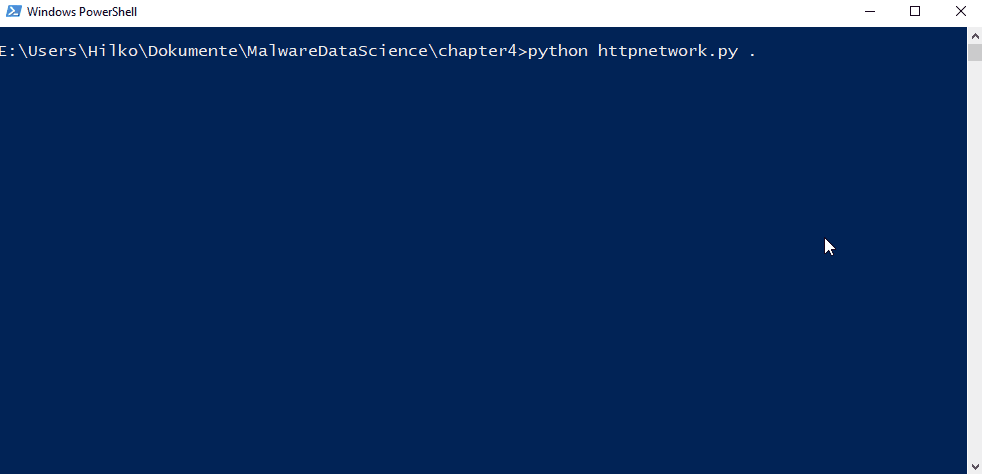

# Chapter 4 - Identifying Attack Campaigns Using Malware Networks

In the fourth chapter, an introduction to the networkx package is given. The package is used to create graphs which can show how different PE-Files are interconnected.
As grouping criteria one could use the imports, images or strings used by a PE file.

## Programming Task: HTTPNetwork

I programmed a tool to generate an HTTP-Network-Graph of different tools. I implemented this without looking too much at the source code from the book, resulting in some differences:

* I use the string-command, too. However, I use the Windows version of it. To do this, please copy the following file to you C:\Windows\System32 directory: https://docs.microsoft.com/en-us/sysinternals/downloads/strings
  The command is a bit different to the unix version, so you might need to change one or two lines if you want to run my code on your unix system.
  
* I did not use pefile to check if the file is a valid PE file. By checking the first two bytes (should be MZ) I recognize PE files. I recommend to do it the same way, since pefile loads internally (if you do not specify fast_load=True) a lot more of data and thus the solution given in the book should be much slower.

* I used an array in my code for loading domain suffixes, instead of using a file.

### Usage

    python httpnetwork.py PATH
    

This will generate a vis.dot file in your directory which can then be used by GraphVIZ (either the GUI or the commandline). In my example I used the fdp algorithm.
