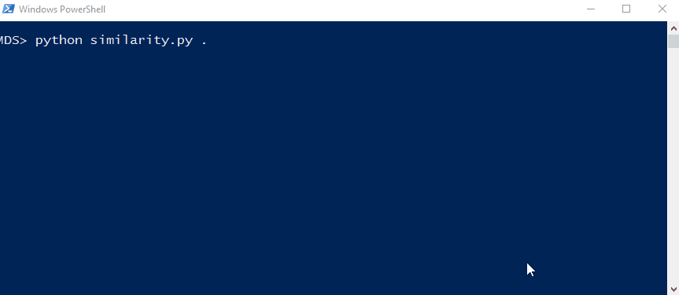

# Chapter 5 - Shared Code Analysis

One way to compare two malware programs is by using shared code analysis, i.e. comparing to which degree both programs share the same code fragments.
The fifth chapter deals with this analysis. 

## Programming Task: Similarity Tester

I developed a tool which uses the jaccard distance to determine, in which degree programs share the same code. It is working about the same as the example given in the book.

However, I want to point out some disadvantages about my naive approach:

* I just use the strings-output for the similarity determination. Of course, there are most likely other variables which are better suited. This methods especially fails, if one uses obfuscation for variables/strings.
* I used the jaccard distance, which might be unsuited for this purpose. Maybe other distance functions (i.e. the levenshtein distance) should be considered, too,
* I did use a naive approach to compare the similarity. As pointed out by the book, using minhash would decrease the runtime of the program a lot.

But after all, I am quite happy with this project :)

### Usage

    python similarity.py PATH
    

